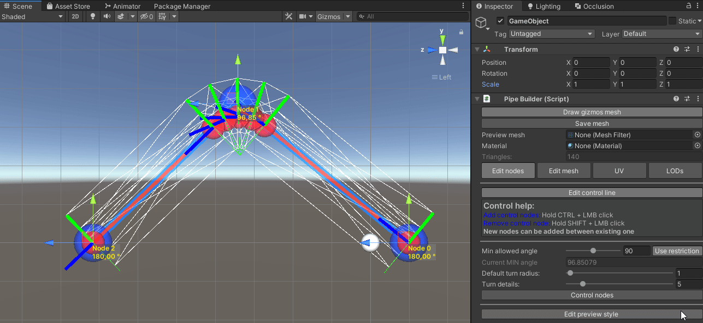
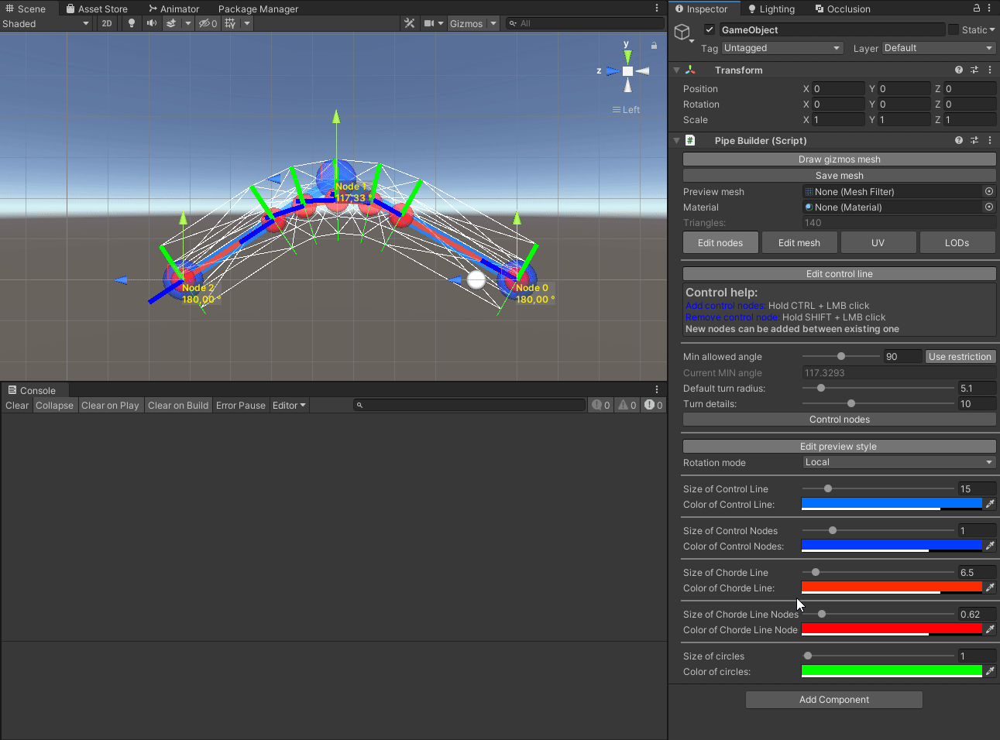

# PipeMeshBuilder
Package for Unity which allows to contruct meshes in an adjustable shape of pipe and generate LOD

Main tool for creating mesh is **PipeBuilder** (MonoBehaviour). Add it to your target GameObject.

**How to preview result**

If you want to preview result with wire mesh, make sure toggle "Draw gizmos mesh" is on and Gizmos are enabled in Unity.
Otherwise you can add MeshRenderer and MeshFilter to the same GameObject and assign MeshFilter to PipeBuilder.

**"Edit nodes" menu**

Mesh generation is based on 2 types of nodes - Control nodes and Chorde nodes.
Control nodes - are primary. They determine key positions for mesh generation and used as a base for Chorde nodes generation.
Chorde nodes are auto-generated, their positions are determined by Control node settings, which they belongs to.

Enabling toggle "Edit control line" allows you to move control nodes, add new nodes and delete exitsing nodes.
Also it disables selection of other GameObjects by click in SceneView.

  To move control node drag its position handle.
  
  To add control node hold CTRL, hover cursor over a line between two existing nodes and click LMB.
  
  To delete control node hold SHIFT, hover cursor over it and click LMB.
  
  
If toggle "Use restriction" is enabled you wont be able to move control nodes in a positions, which will form an angle to a line that is lower, than Minimum allowed angle value.
Also it would prevent removing Control nodes, if it leads to forming too sharp angle.

You can change default turn radius (which determines smoothess of the turn) and default turn details (which determines how many Chorde nodes will be generated)

Enabling toggle "Сontrol nodes" will allow you to manually set each node position and override its turn radius and turn details.
Keep in mind, that this way of moving nodes is not validated by any checks.

Enabling "Edit preview style" opens settings of visual handles. Also it allows to switch position handle rotation type between World/Local/Relative (to next)

**"Edit mesh" menu**

This menu allows to change detail quality of mesh, choose if you need outer/inner side and edges.
Also it allows to control inner/outer radius and add extra rotation for vertices along Chorde line.
Toggle "Control nodes" allows to override raduis settings for each Control node.

**"UV" menu**

This menu allows to edit UV settings by 2 modes: manual and texture map.
Texure map mode allows you to choose how many rows in your texture and determine offset between them, select which row will be used for calculating UVs (in lenght).
This will pre-calculate tiling and offset.
Same for edges (their rows should be same height as regular ones), but you also should determine amount of columns and offset between them.
Auto-X-tiling will apply sacling for UV tiling X by default radius and pipe lenght.

**"LODs" menu**

This menu allows to determine count of LODs that should be generated and degrade step for each LOD. Degrade step applies to Circle detail down to 3.
Generate LODs button will instantiate new GameObjets and assign meshes.

!!! Important !!!
Also if you choose to save meshes as assets they wont be serialized in scene, which is good for performance.
**Target folder should be under "/Assets" directory.**

# PipeMeshCombiner

This tool allows to combine several PipeBuilders LOD-assets into one. This means that LOD[0] mesh of PipeBuilder_1 will be cobined with LOD[0] mesh of PipeBuilder_2 and etc.
This requires all target PipeBuilders have same number of LOD-elements.
This is good for performance if some of your pipes are using same material.
